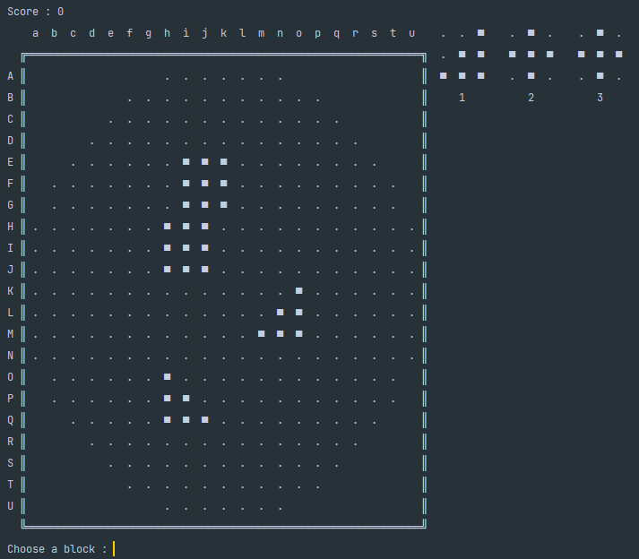
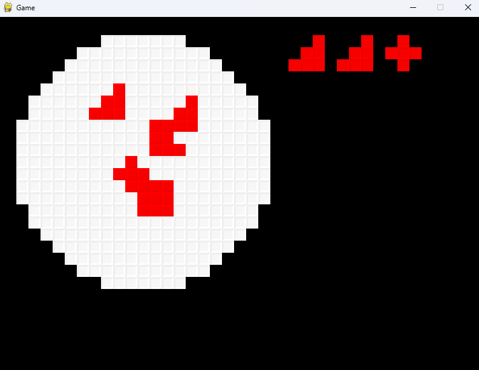

# BoxFiller
> Little game where you have to fill a box with blocks.

In this game you have to put block that are showed to you in a box represented by a grid.
When you complete a line, the blocks on the line are removed and the blocks above fall down and when you complete a column the blocks of the column are removed.
The more you remove blocks at the same time the more points you get.
When you place the block in the wrong place you lose a life.
When you lose all your lives the game is over.

> Example of the game in the terminal
> 

> Example of the game in pygame
> 